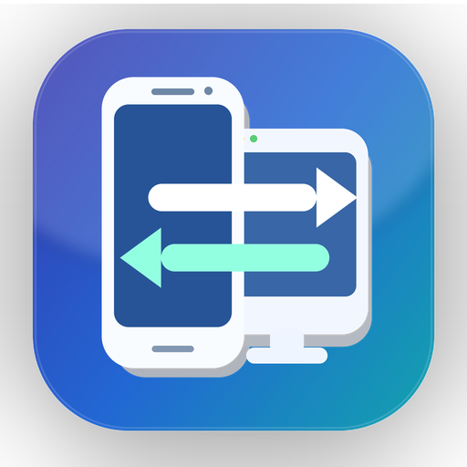
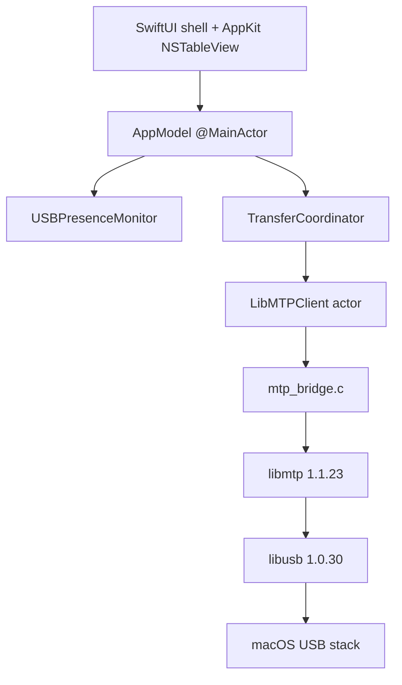

<p align="center">
  
</p>

<h1 align="center">Mac Android Transfer V2</h1>

<p align="center">
  Apple Silicon macOS 的原生 Android MTP 檔案瀏覽與雙向傳輸 App。<br>
  不需要把手機掛載成磁碟，也不依賴 Homebrew。
</p>

<p align="center">
  <strong>Version 0.7.0 · macOS 14+ · Apple Silicon · MIT License</strong>
</p>

## 功能

- 直接瀏覽 Android 手機的 MTP 共享儲存空間。
- Mac ↔ Android 雙向傳輸檔案與資料夾。
- Finder 拖入上傳、Finder File Promise 拖出下載。
- 原生 AppKit 檔案表格：多選、排序、欄寬調整、雙擊開啟與搜尋。
- 下載續傳策略、上傳安全替換、重試、取消、暫停與傳輸佇列。
- USB 實體拔線快速偵測，不讓卡住的 MTP session 阻塞 UI。
- 傳輸工作綁定手機身分，降低重新連線後傳到錯誤裝置的風險。
- 插入 MTP 手機時可由背景 Login Item 自動開啟主 App。
- 繁體中文與英文介面。

## 系統需求

- Apple Silicon Mac（arm64）
- macOS 14 或更新版本
- 可用的 Apple Command Line Tools / macOS SDK
- Android 手機切換到「檔案傳輸 / Android Auto」USB 模式

## 安裝與啟動

下載或 clone repository 後，在 Finder 打開 `Tools/`，雙擊：

```text
Tools/安裝並啟動 Android 傳輸 V2.command
```

安裝器會：

1. 先檢查完整 SwiftUI / AppKit 原始碼與建置前置條件。
2. 優先沿用相容的本機 arm64 `libmtp` / `libusb`。
3. 缺少依賴時，只在專案內 `.local/` 使用隨附、固定版本且有 SHA-256 驗證的來源碼建置。
4. 建立 `dist/Android 傳輸 V2.app`。
5. 驗證並啟動 App 以及內嵌的手機插入偵測器。

不會自動安裝或更新 Homebrew、MacPorts 或其他系統套件，也不需要 `sudo`。

## 使用方式

1. 用 USB 連接 Android 手機並解鎖。
2. 在手機 USB 選項選擇「檔案傳輸 / Android Auto」。
3. 如手機要求權限，允許 Mac 存取。
4. Android 傳輸 V2 會顯示可用儲存空間與目前資料夾。
5. 可使用工具列、拖放或 Finder 進行上傳與下載。

若舊版 Android File Transfer 正在佔用 MTP，App 會提示先暫時關閉舊主程式，而不會停用其背景 Agent。

## 架構



核心設計原則是：MTP session 序列化、UI 與物理拔線狀態解耦、傳輸先驗證再替換、避免全裝置預掃，並把 libmtp 指標與 C callback 生命週期隔離在小型 C ABI。

更完整的實作說明請見 [架構文件](docs/ARCHITECTURE.md)。

## 0.7.0 重點

0.7.0 修正舊背景 helper 在原 App 路徑已移動或刪除後仍嘗試開啟不存在父 App，造成插入手機時出現「找不到檔案」的問題。

新版會：

- 解除舊 helper 註冊。
- 將註冊身分綁定到目前 build、package identity 與精確 App 路徑。
- 啟動前驗證 bundle、可執行檔與 bundle identifier。
- 父 App 不存在時透過 Launch Services 尋找目前有效的 Android 傳輸 V2。
- 保留 0.6.11 已驗收的手機 ↔ Finder 雙向檔案與資料夾傳輸核心。

完整版本紀錄請見 [CHANGELOG.md](CHANGELOG.md) 與 [0.7.0 裝置啟動修復說明](docs/history/DEVICE_LAUNCH_FIX_0.7.0.md)。

## 建置與驗證

專案包含 Swift、C bridge、建置稽核與回歸測試腳本。常用入口包括：

```bash
./Scripts/verify.sh
./Scripts/run-c-bridge-tests.sh
./Scripts/run-smoke-test.sh
./Scripts/build-local-app.sh
```

Xcode 專案可由：

```bash
./Scripts/generate-xcode-project.sh
```

產生。

## 安全與隱私

- 不包含遙測、廣告 SDK 或網路 API。
- 不會上傳手機檔案、序號或日誌。
- App 使用 Sandbox、USB device、user-selected read/write 與 app-scoped bookmarks。
- 下載到 Mac 的內容仍應視為不受信任檔案。
- 正式散布版本仍應完成 Developer ID 簽章、notarization、stapling 與乾淨機 Gatekeeper 驗證。

詳見 [SECURITY.md](SECURITY.md)。

## 文件

- [架構文件](docs/ARCHITECTURE.md) — 完整系統架構與資料流
- [SECURITY.md](SECURITY.md) — 權限、資料處理與安全界線
- [測試計畫](docs/development/TEST_PLAN_0.7.0.md) — 0.7.0 實機與回歸測試
- [發布檢查表](docs/release/RELEASE_CHECKLIST_0.7.0.md) — 0.7.0 發布驗證
- [THIRD_PARTY_NOTICES.md](THIRD_PARTY_NOTICES.md) — 第三方授權聲明
- [CHANGELOG.md](CHANGELOG.md) — 版本紀錄

## 作者

**Jason Chen**

GitHub 專案名稱為 **Mac Android Transfer V2**。0.7.0 的 macOS App 顯示名稱仍保留為 **Android 傳輸 V2**，以避免破壞既有 bundle、背景 helper、安裝路徑與回歸測試相容性。

## License

Android 傳輸 V2 採用 [MIT License](LICENSE)。第三方 `libmtp` / `libusb` 授權資訊位於 `Vendor/licenses/` 與 [THIRD_PARTY_NOTICES.md](THIRD_PARTY_NOTICES.md)。
